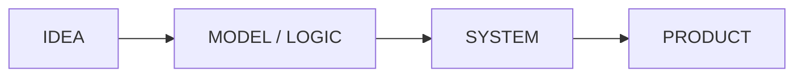
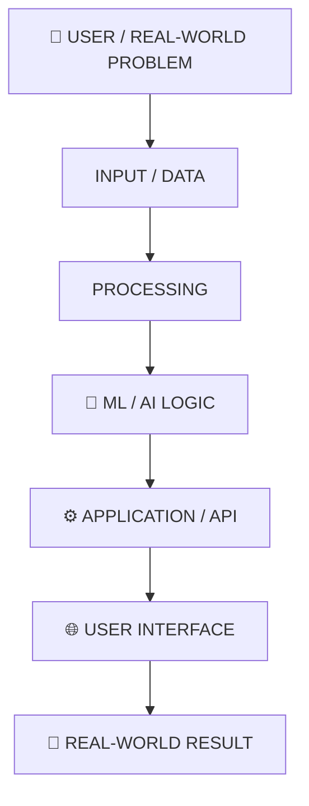
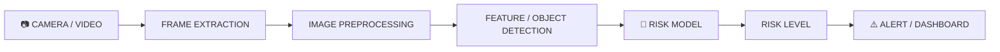
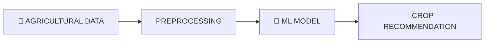

<div align="center">

<!-- ═══════════════════════════════════════════════════════════════ -->
<!--                         ANIMATED HERO                           -->
<!-- ═══════════════════════════════════════════════════════════════ -->


<br>


<br><br>

<a href="https://github.com/VaibhavYadav">
  
</a>

<a href="https://github.com/VaibhavYadav">
  
</a>

<br><br>


<br><br>


<br><br>


</div>

<br>

<div align="center">


<br>

### AI / ML ENGINEER &nbsp;•&nbsp; MACHINE LEARNING BUILDER &nbsp;•&nbsp; DEVELOPER TOOLS &nbsp;•&nbsp; 3D WEB

<br>

> <b>Turning ideas, machine learning and software into useful products.</b>

</div>

<br>

---

# 🧠 `THE BUILDER`

## Building at the intersection of AI, software & creative technology.

I'm **Vaibhav Yadav**, a developer focused on building practical software, machine-learning systems, developer tools and immersive web experiences.

My work spans:

- 🔹 **Machine Learning & Predictive Analysis**
- 🔹 **AI-powered developer tools**
- 🔹 **Computer Vision**
- 🔹 **Python-based software systems**
- 🔹 **Full-stack web development**
- 🔹 **Three.js / WebGL experiences**
- 🔹 **Linux & system administration**
- 🔹 **Problem-solving through software**

### My core idea



<div align="center">

```text
╭──────────────────────────────────╮
│          ⚡ VAIBHAV.LAB          │
├──────────────────────────────────┤
│  🧠 MACHINE LEARNING   ████████  │
│  🤖 AI SYSTEMS         ████████  │
│  🔍 COMPUTER VISION    ███████   │
│  ⚙️  SOFTWARE          ████████  │
│  🌐 3D WEB            ████████  │
│                                  │
│  STATUS: ● BUILDING              │
╰──────────────────────────────────╯
```


</div>

---

# ⚡ `TECH STACK`

<div align="center">


</div>

### 💻 Languages


`Python` · `Java` · `JavaScript` · `HTML5` · `CSS3`

### 🧠 AI / Machine Learning


`Machine Learning` · `Predictive Analysis` · `Computer Vision` · `OpenCV` · `Scikit-learn`

### 🌐 Web & 3D


`HTML5` · `CSS3` · `JavaScript` · `Three.js` · `WebGL` · `Interactive 3D`

### 🗄️ Data / Backend / Tools


`REST APIs` · `SQL` · `Git` · `GitHub` · `Linux` · `RHEL`

---

# 🌌 `HOW I BUILD`

<div align="center">


</div>



---

# 🚀 `FLAGSHIP BUILD — REPOMIND`

<div align="center">


</div>

## What is RepoMind?

**RepoMind** is an AI-powered developer tool designed to make large software repositories easier to understand. It processes repository content, retrieves relevant context and uses AI to provide natural-language explanations and answers.

### Core idea

```text
REPOSITORY
    ↓
FILE FILTERING
    ↓
CODE / TEXT EXTRACTION
    ↓
CHUNKING
    ↓
EMBEDDINGS / INDEXING
    ↓
RELEVANT CONTEXT
    ↓
AI REASONING
    ↓
DEVELOPER ANSWER
```

### Core capabilities

- 🤖 **Natural-language repository Q&A**
- 🔎 **Context-aware semantic search**
- 📄 **File and code explanations**
- 🧩 **Project-structure understanding**
- 🔐 **Authentication and user sessions**
- 📊 **Repository dashboard**
- 📱 **Responsive developer interface**

### Tech stack

`Python` · `FastAPI` · `LLM / AI APIs` · `Embeddings` · `ChromaDB` · `PostgreSQL` · `GitHub Integration` · `REST API`

> **Repository → Context → Intelligence → Developer Answer**

---

# ⛰️ `SLOPE SENTINEL`

<div align="center">


</div>

**Slope Sentinel** is an AI-based slope and rockfall risk monitoring concept that uses computer vision and machine learning to analyze visual indicators associated with hazardous slope conditions.

### Computer-vision pipeline



### Risk levels

| Level | Meaning |
|---|---|
| 🟢 **Normal** | No significant abnormal visual pattern detected |
| 🟡 **Warning** | Indicators require attention or additional monitoring |
| 🔴 **Critical** | Strong indicators suggest immediate inspection or safety action |

### Tech stack

`Python` · `OpenCV` · `Machine Learning` · `Computer Vision` · `API / Dashboard`

> **Camera → Vision → Prediction → Risk Level → Early Warning**

---

# 🌾 `CROP RECOMMENDATION SYSTEM`

### Machine Learning for smarter agricultural decisions.

A predictive machine-learning project that recommends suitable crops using agricultural parameters such as:

`NPK` · `Rainfall` · `Humidity` · `Temperature` · `pH`

### Stack

`Python` · `Scikit-learn` · `Machine Learning` · `HTML` · `CSS`



---

# 🌌 `CINEMATIC 3D PORTFOLIO`

<div align="center">


</div>

A cinematic 3D portfolio where the visitor follows a story-driven journey instead of scrolling through a conventional website.

```text
🚌 BUS STAND
      ↓
🛣️ ROAD
      ↓
🏛️ PLAZA
      ↓
🏆 ACHIEVEMENTS
      ↓
🪂 PROJECTS
      ↓
🏢 FINAL BUILDING
      ↓
🌎 MY WORLD
```

### Built with

`HTML5` · `CSS3` · `JavaScript` · `Three.js` · `WebGL`

### Design direction

- 🌌 Dark cinematic environment
- 💠 Blue / cyan visual language
- 🎮 Interactive 3D movement
- 🏙️ Story-driven world
- 📱 Responsive/mobile fallback
- ✨ Smooth transitions and animation

---

# 📊 `ENGINEERING TELEMETRY`

<div align="center">


<br><br>

<a href="https://github.com/VaibhavYadav">

</a>

<br><br>

<a href="https://github.com/VaibhavYadav">

</a>

<br><br>


<br><br>


</div>

---

# 🌌 `ACTIVITY STREAM`

<div align="center">


<br><br>


</div>

---

# 🐍 `CONTRIBUTION ENGINE`

<div align="center">


<br><br>


<br><br>

<picture>
  <source
    media="(prefers-color-scheme: dark)"
    srcset="https://raw.githubusercontent.com/VaibhavYadav/VaibhavYadav/output/github-contribution-grid-snake-dark.svg"
  />
  <source
    media="(prefers-color-scheme: light)"
    srcset="https://raw.githubusercontent.com/VaibhavYadav/VaibhavYadav/output/github-contribution-grid-snake.svg"
  />
  
</picture>

</div>

---

# 🖥️ `DEVELOPER TERMINAL`

<div align="center">


<br><br>


</div>

```text
vaibhav@lab ~ % whoami
> Vaibhav Yadav

vaibhav@lab ~ % role
> AI / ML Engineer
> Developer
> Machine Learning Builder

vaibhav@lab ~ % focus
> Machine Learning
> AI Systems
> Computer Vision
> Developer Tools
> Three.js / 3D Web
> Linux

vaibhav@lab ~ % flagship
> RepoMind
> Slope Sentinel

vaibhav@lab ~ % philosophy
> IDEA → SYSTEM → PRODUCT

vaibhav@lab ~ % status
> ● ONLINE
```

<div align="center">


</div>

---

# ✦ `ENGINEERING PHILOSOPHY`

<div align="center">

| | | |
|:---:|:---:|:---:|
| 🧠 <br> **LEARN DEEPLY** | 🏗️ <br> **BUILD WITH PURPOSE** | 🚀 <br> **SHIP CONSTANTLY** |
| 📐 <br> **SOLVE REAL PROBLEMS** | 🔥 <br> **IMPROVE RELENTLESSLY** | 🌌 <br> **STAY CURIOUS** |

<br>


</div>

---

# 🌠 `WHAT'S NEXT`

<div align="center">


<br><br>

| 🤖 | 🧠 | 🔍 | 🌐 |
|:---:|:---:|:---:|:---:|
| **AI SYSTEMS** <br> Intelligent workflows | **MACHINE LEARNING** <br> Predictive systems | **COMPUTER VISION** <br> Visual intelligence | **3D WEB** <br> Immersive experiences |

</div>

---

# 💜 `LET'S BUILD`

<div align="center">


<br><br>


<br><br>


<br><br>

<a href="https://github.com/VaibhavYadav">
  
</a>

<br><br>

<sub>AI · MACHINE LEARNING · SOFTWARE · 3D WEB · INNOVATION</sub>

</div>

<br>

---

<div align="center">


<br><br>


<br>


</div>
