<h2>VAIBHAV // SYSTEM METRICS</h2>

  CODE • CONTRIBUTIONS • LANGUAGE SIGNAL

 

<table>
  <tr>
    <td width="50%" align="center">
      
    </td>
    <td width="50%" align="center">
      
    </td>
  </tr>
</table>

 

  GENERATED FROM VAIBHAVY15 GITHUB ACTIVITY

